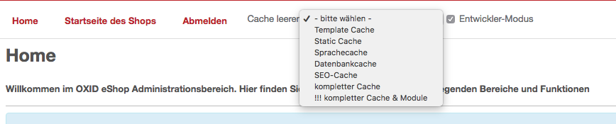

Great module proudly presented by [OXID Hackathon 2017](https://openspacer.org/12-oxid-community/185-oxid-hackathon-nuernberg-2017/) ;-)

Module version for OXID eShop 6. Original module by [OXID cookbook](https://github.com/OXIDCookbook/ocb_cleartmp).

# Features

	- clear all/different cache types in shop admin
  - developer mode -> dont´use cache

# Installation

```
composer require oxid-community/ocbcleartmp
```

# Screenshot




# Changelog

	2017-12-11  2.0.1 fix GLOB_BRACE musl-based dists
  2017-12-10	2.0.0 module release
